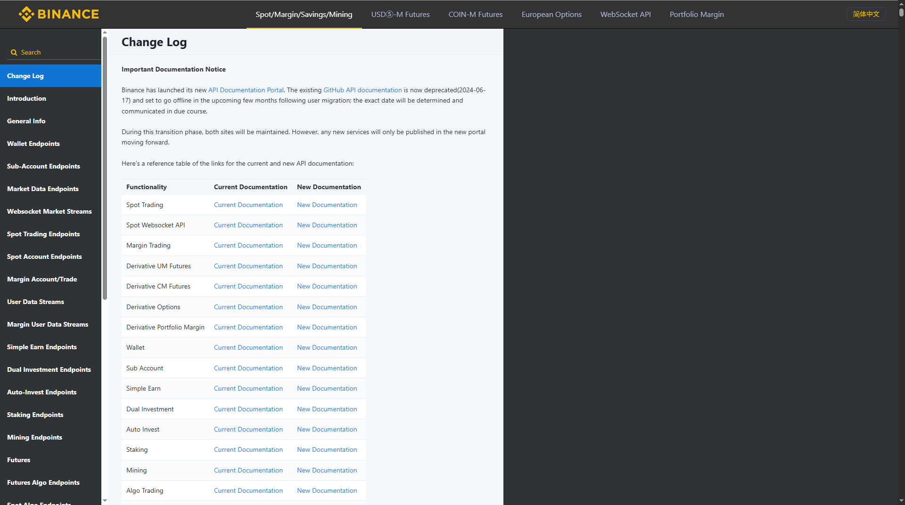
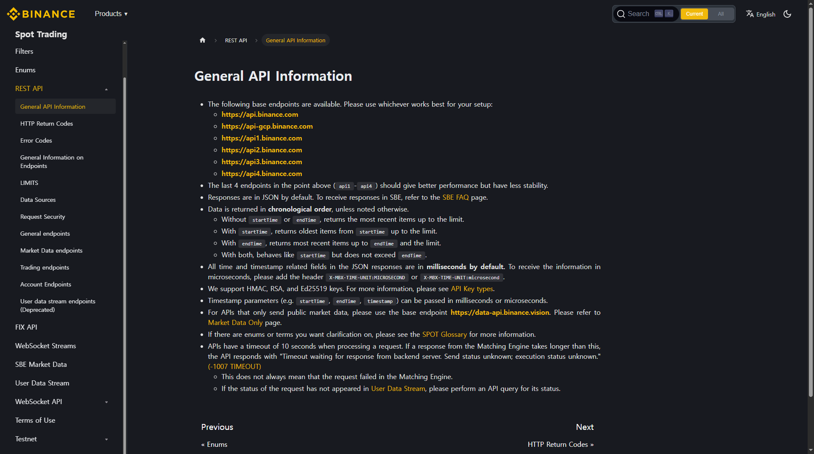
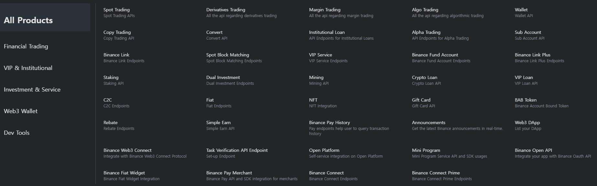
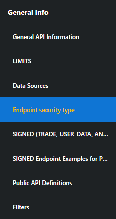
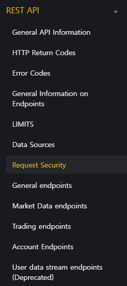
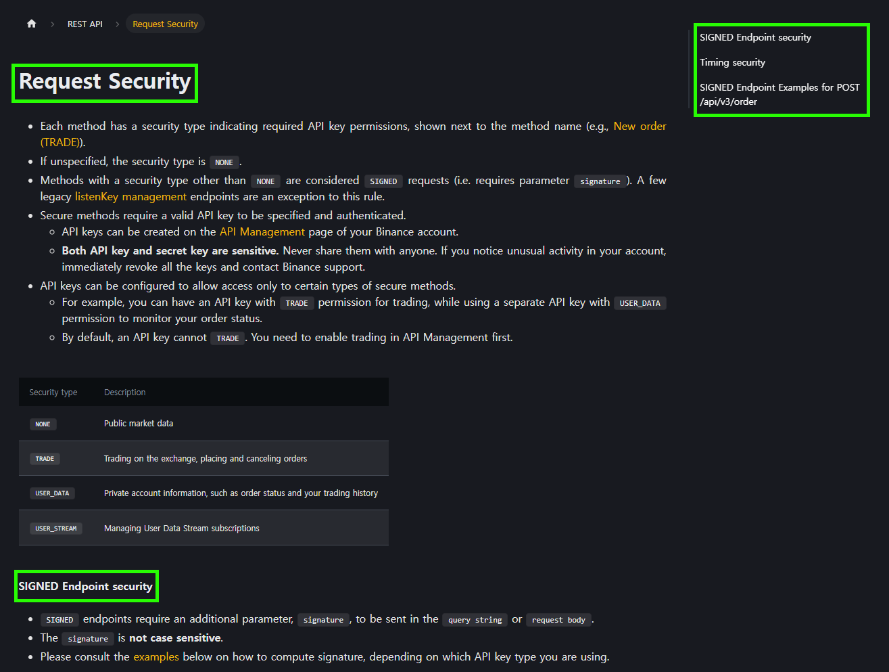

+++
title = "Miscellaneous Thoughts on the Binance Documentation Update"
date = 2025-10-03
[extra]
toc = true
comment = true
+++

벌써 5년전에 이르는 지난 2021년 경, 여러 암호화폐 거래소의 기능을 통합해 SPA(Single Page Application)로서 사용할 수 있는 WTS(Web Trading System) 형태의 프로덕트를 만든 적이 있다. 당시 프로덕트에서 지원헀던 거래소로는 Upbit, Bithumb 과 같은 우리나라 거래소와 더불어 Binance, Huobi(현 HTX), OKEX(현 OKX), MXC(현 MEXC), KUCOIN 으로 총 7곳이었다.

프로덕트 개발을 위해서는 이렇게 다양한 거래소들의 API를 어떻게 잘 처리할 것인지가 핵심이었다. 각 거래소마다 요청 시 요구하는 인증(Authentication) 방식도 제 각각이고, 같은 동작이더라도 미묘하게 다른 이름의 파라미터 값을 가지고 있었다.

 바퀴를 다시 발명하지마라 (Don't reinvent the wheel.) 

개발자라면 이렇듯 다양한 암호화폐 거래소 API를 통합된 언터페이스로 잘 추상화하여 개발하기 편하도록 제공한 라이브러리가 이미 있을 수 있을 것이라고 생각할 것이다. 이미 개발되어 있는 것을 굳이 다시 개발하는 것 만큼 비효율적인 것도 없다. 실제로 [CCXT](https://github.com/ccxt/ccxt) 라는 오픈소스 라이브러리가 존재했고, 내가 개발하는 프로덕트와 같은 케이스에 사용하기에 딱 맞는 라이브러리였다.

그럼에도 불구하고 나는 해당 라이브러리를 당장 채택하기보다는 고민에 빠졌다.

지금도 별로 개발 실력이 좋진 않지만, 해당 프로덕트를 구현할 때에는 공부가 정말 많이 필요한 상태였다. 개발에 대해 공부하는 입장에서 7개의 거래소의 문서를 전부 다 직접 읽어가며 개발하면 다음과 같은 경험을 통한 배움이 있지 않을까 고민하였다.

1. 좋은(혹은 좋지 않은) RESTful API 설계가 어떠한 것인지에 대한 경험
2. 잘(혹은 못) 쓴 문서에 대한 독자로서의 경험
3. 영어 읽기 능력 향상 등 부수적인 경험

잘 작성된 문서와 API 아키텍처를 접하는 것은 당연히 좋은 경험일테고, 못 쓴 문서와 API 아키텍처를 경험하는 것도 공부가 되리라 생각했다. 프로덕트가 빨리 개발되어야 했지만, 개발하는 과정에서의 공부도 중요하다고 생각해 결국 직접 암호화폐 거래소 7곳의 문서를 다 읽어가며 개발하기로 결정했다.

그 때의 결정은 역시 좋은 경험으로 남았고, 위에서 언급한 3가지 배움을 통해 문서에 대한 _literacy_ 가 어느정도 생긴 듯하다.

그러던 중 Binance의 문서를 다시 볼 일이 생겼다. Binance의 경우에는 당시에도 잘 쓰여진 문서라고 느꼈는데, 이번에 Binance 문서를 다시 보게되니 개편된 부분이 눈에 띄어서 당시의 경험과 개편된 Binance 문서에 대해 짧게 기록하고자 이 글을 남긴다.

## Old Binance Documentation Summary

예전 Binance 문서는 [`slate`](https://github.com/slatedocs/slate) 로 작성되었다.

아래 이미지는 당시 Binance 문서를 Wayback Machine에 어카이빙 된 것을 크롬 개발자 도구를 통해 캡쳐한 것이다. (관련 Github Repository의 경우 rebase 처리되는 등 원본 소스를 찾기는 어려웠다)

비교를 위해 선택한 아카이빙 일자는 해당 문서가 deprecated 처리 된 일자(2024-07-17)에 가장 가까운 날로 선택했다.

`slate` 는 Ruby로 구현된 SSG(Static Site Generator)로서 공식 레포지토리의 `README.md`에 따르면 아래와 같은 특징을 지닌다.

- 깔끔하고 직관적인 디자인 (Clean, intuitive design ~)
- 단일 페이지 (Everything on a single page ~)
- Markdown 기반 (Slate is just Markdown ~)

실제로 처음 접했을 떄도 깔끔하고 직관적인 디자인이라고 느꼈다. 한 페이지에 모든 정보를 포함시키다보니 생긴 긴 세로 스크롤 때문에 처음에는 스크롤 압박이 있었지만, 적응되고나서는 검색 기능이나 CTRL(CMD) + F 기능을 통해 원하는 섹션을 바로 참조할 수 있었다.

그럼에도, 환경에 따라 다르겠지만 FHD 24인치 모니터 기준 `document.documentElement.scrollHeight` 를 통해 확인한 Y축 스크롤값이 `435958` 에 달한다. 상당히 긴 내용을 한 페이지에 담다보니 모르는 내용을 새롭게 찾아야할 때는 스크롤을 열심히 굴려가며 찾아야했다.

이는 Binance 자체적으로 제공하는 다양한 기능과 시장 유형(Spot / Margin / Future)에 따라 늘어난 Endpoint에 의한 것이었다.

가령, 자산을 외부 거래소로 출금해야할 때, 해당 자산이 담보로서 역할하고 있다면 미리 정해진 비율에 따라 자산의 일부만이 출금될 수 있다.

이 때 Binance는 거래소 외부로 옮길 수 있는 자산의 정확한 수량을 조회 할 때 `/maxTransferable` 이라는 Endpoint를 제공하여 한 번의 API 호출로 편리하게 수량을 계산할 수 있었다.

이에 반해, 당시 다른 거래소는 해당 수량을 직접 계산하기 위해서 자산의 보유 수량과 가격을 조회하는 등 여러 번 다른 Endpoint를 거치고 나서야 해당 수량을 계산할 수 있었다. 여기에 더해, 실시간으로 Quote Asset(가령, USDT)으로 표기되는 자산의 가치가 변하는 것도 고려해야했다.

정리하자면,

1. 예전 Binance 문서는 UI 측면에서(긴 세로 스크롤) 개선할 여지가 있어 보였지만, 치명적인 문제는 없었다.
2. API 아키텍칭의 측면에서는 정말 세심한 부분까지 꼼꼼히 잘 설계했다.

## New Binance Documentation Summary

개편된 Binance 문서는 HTML meta 태그를 보면 [`docusaurus`](https://docusaurus.io/) 기반인 것으로 보인다. 실제로 UI 구성도 전형적인 `docusaurus`의 그것과 같다.

아래 이미지는 현재 Binance 문서를 크롬 개발자 도구로 캡쳐한 것이다.

`docusaurus` 는 facebook(현 META)이 주도적으로 개발한 SSG(Static Site Generator)로서 `slate`에 대비되는 특징은 다음과 같다.

- MDX 지원
- 다양한 Plugin 지원 (Algolia 등 검색 기능 개선 Plugin 등)
- 여러 페이지 및 버전 관리 기능

아무래도 Binance의 기존 기능과 시장에 따라 Endpoint의 형태도 다양하고, 프로덕트도 점점 늘어나다보니 Developer Center 온보딩 페이지를 별도로 만들고 문서도 Docusaurus를 통해 다시 빌드되었다. 아래 사진은 Binance에서 제공하는 여러 프로덕트의 문서 목록이다.

예전 `slate`로 작성된 문서와 비교하면 내용은 크게 변한 것이 없지만, 절차지향 언어처럼 세로로 길게 나열된 내용이 적절히 페이지 단위로 나누어 보기 좋게 재배치되었다. 가령, 인증이 요구되는 API 요청시에 기술적인 인증 방법에 대해 논하는 섹션 제목을 주로 **인증(Authentication)** 으로하여 설명하는데[^1], Binance의 경우 예전 문서에서는 **Endpoint security type** 이라는 섹션에서 설명하고 있다. 구 문서에서는 아래와 같은 ToC로 구성되어 있다.

반면, 새로이 개편된 문서에서는 아래와 같은 ToC로 구성되어 있다.

기존에는 **Endpoint security type** 이라는 제목으로 섹션을 두어, 각 Endpoint의 보안 유형에 따라 처리해야할 방식이 달라져야 함을 설명했다. 결국 API 이용시의 인증(Authentication)에 대한 기술적인 명세인데, 새로이 `docusaurus` 로 문서를 옮기면서는 **Request Security** 라는 명료한 제목으로 변경하였다.

특히, 예전 버전의 문서에서는 아래와 같은 제목으로 연이어 작성된 항목에서 HMAC SHA256 알고리즘을 활용한 인증 방법에 대해서 구체적인 예시를 들어 설명하고 있다.

- SIGNED (TRADE, USER_DATA, AND MARGIN) Endpoint security
- SIGNED Endpoint Examples for POST /api/v3/order - Ed25519 Keys

그럼에도 불구하고, **Endpoint security type** 하위의 항목으로 작성되지 않고, 같은 계층의 ToC로 작성되었는데, 새로이 `docusaurus`로 작성된 버전에서는 **Request Security** 의 하위 항목으로 아래와 같이 재작성되었다.

이 외에도, 사소한 개선 사항이 존재하지만 전체적인 내용은 동일한 것으로 보인다. 다른 프로덕트의 명세에 활용되었는지 모르겠지만, MDX의 커스텀 컴포넌트 기능을 활용하거나 `docusaurus`의 기능을 활용한 특색있는 페이지는 아직 찾지 못했다. 결론적으로, Binance는 독자가 읽기 편하도록 종(縱)으로 길게 나열되어 작성된 `slate` 에서 소제목이나 프로덕트 별로 페이지로 나누어져 읽기 편한 `docusaurus`로 문서 SSG 를 변경한 것으로 보이고, 실제로 그 목적을 달성한 것 같다. Lighthouse와 같은 점수의 경우, 아무래도 문서의 길이가 길어질수록 `docusaurus`에게 유리할 것 같아서 현재 버전이 더 좋을 것 같기는 한데, 예전 문서를 Wayback Machine으로 밖에 접근하지 못해서 산출해보지 못한 아쉬움이 있다. 앞으로 Binance 뿐만아니라 여러 다양한 프로덕트와 플랫폼에서 목적에 따라 어떤 문서화 도구를 사용했는지 주의깊게 살펴보면 좋은 공부가 될 것 같다.

---

[^1]: [Stripe API 문서](https://docs.stripe.com/api/authentication)의 경우 Introduction 바로 아래에 Authentication 항목을 배치했다.
