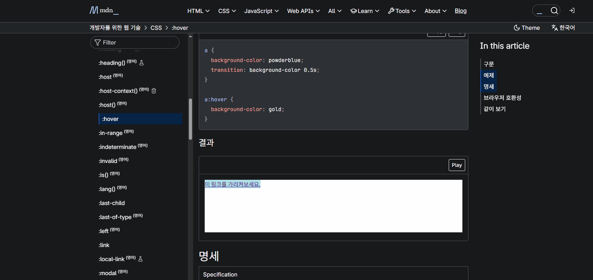
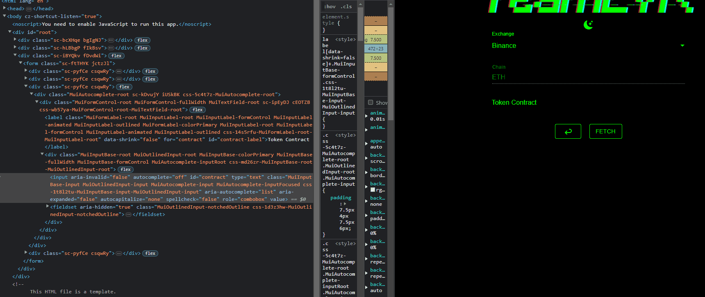
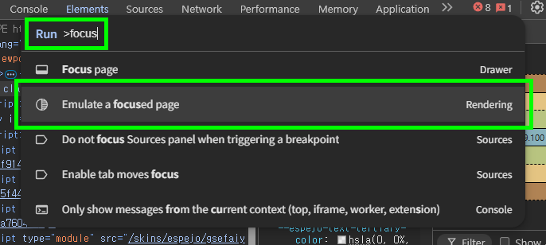
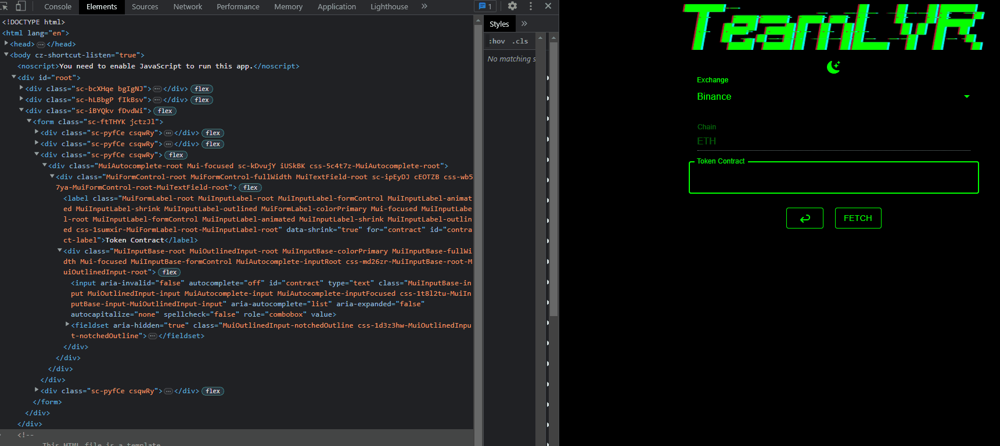
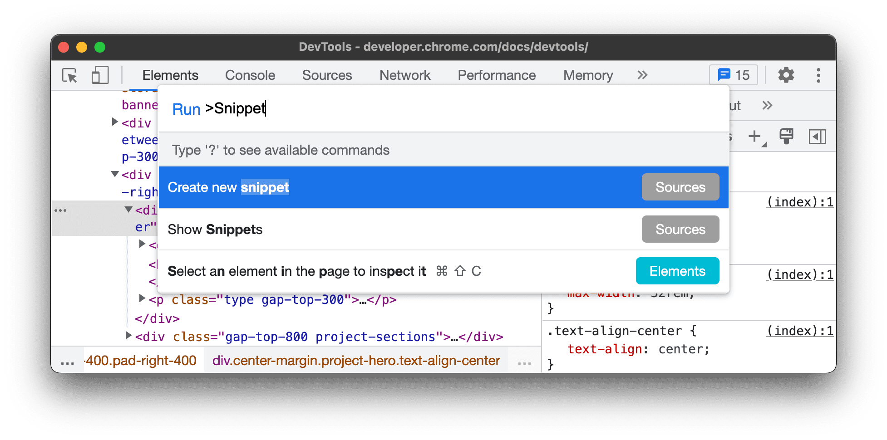
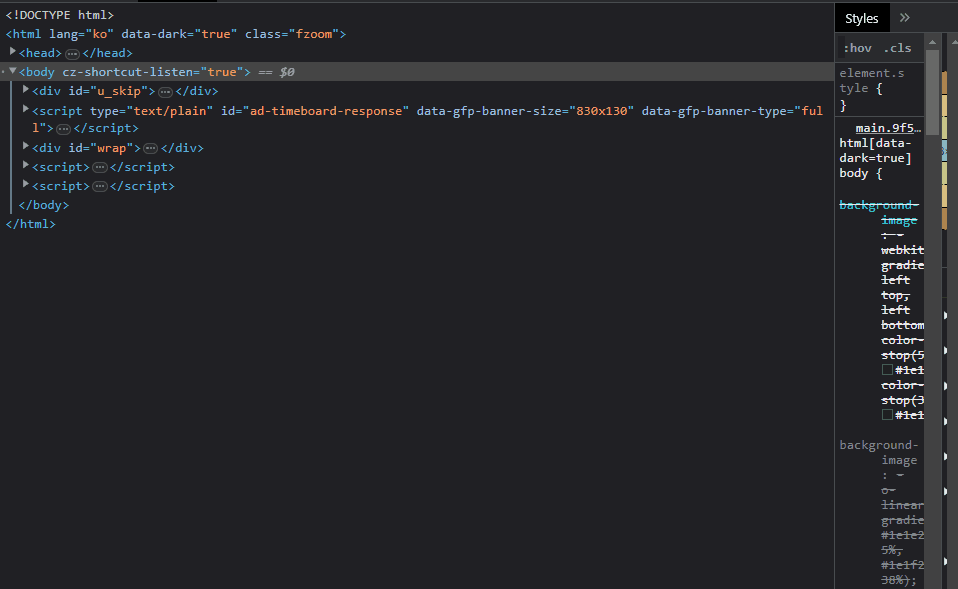

+++
title = "Miscellaneous Notes on Chromium Developer Tools"
date = 2023-03-15
[extra]
toc = true
comment = true
+++

크로미움 개발자 도구에는 무수히 많은 기능이 있어서 각 기능에 대해서 문서를 찾아서 공부할 필요가 있을 정도다. 적어도 웹 개발 관련해서는 알아두면 좋은 기능이 많아보인다. 그래서 한 번쯤은 기능에 대해 정리해놓는게 좋을 것 같아서 기록해두어야 겠다고 생각이 들었다. 새로이 알게되는 유용한 기능이 있다면 이 글에 연달아 작성해 볼 생각이다.

## Keyboard shortcuts

우선 키보드 숏컷부터 간단하게 정리해보았다.

**C** stands for CSS / **J** stands for JavaScript / **I** stands for My Chocie ([Chrome for Developers Youtube | Different ways to open Chrome DevTools 영상 내용 중](https://youtu.be/X65TAP8a530))

- `Cmd(Ctrl) + Option(Shift) + C` : Open the Elements Panel, 마우스 커서를 올려둔 HTML 요소를 Elements 패널에서 확인할 수 있게 해준다. 우클릭 후에 검사를 눌러서 하던 것에 비하면 아주 편하다. 마우스 위치에 따라 사라지는 항목에 대해서도 선택할 수 있게 한다.
- `Cmd(Ctrl) + Option(Shift) + J` : Open the Console, Console 탭을 바로 열어줘서 바로 JavaScript를 쓸 수 있다. F12 버튼을 눌러서 마우스로 Console 탭을 찾아가는 것 보다는 빠르다.
- `Cmd(Ctrl) + Option(Shift) + I` || `F12` : Open the last panel you used, 개발자 도구를 연다. 이미 열었다가 닫은 거라면 마지막에 열었던 패널을 열어준다. 마지막에 열었던 패널이 Console이면 Console, Network 패널이면 Network 패널이 열린다. 다만 노트북같은 환경이라서 function키와 함께 눌러야 하는게 아니라면 `F12`키를 누르는게 더 편할 것 같다.
- `ESC` : Elements 패널에서 누르면 Drawer를 여닫아준다. Console이 Drawer에도 있어서 Elements 패널에서도 Console을 사용할 수 있다.

위의 키보드 숏컷을 이용하면 마우스없이도 패널을 Elements, Console 패널로 전환할 수 있다.

## Command Menu

크로미움에서 지원하는 다양한 기능을 접근할 때 개발자 도구의 UI를 일일이 클릭하기보다 Command Menu를 통해 키보드로 바로 기능에 접근할 수 있다. (Electron 및 chromium을 기반으로한 VSCode의 Command Pallete와 단축키도 같고 기능도 거의 같은 기능이다) 직접 개발자 도구에서 마우스로 기능을 클릭하는것 보다 대부분 Command Menu에서 원하는 명령어를 입력하는게 빠르다.

- 개발자 도구 진입 후, `Ctrl(Cmd) + Shift + P` : Command Menu를 띄워준다.


## 사라지는 HTML 요소 디버깅하기

사라지는 HTML 요소를 디버깅해야할 때가 있는데, 글보다는 [Chrome for Developers Youtube | Freeze screen & inspect disappearing elements](https://youtu.be/Qzmb9bdNzZ4) 영상에서 확인하면 어떻게 하는지 쉽게 이해할 수 있다.

### Force element state

앞서 언급했던 `Cmd(Ctrl) + Option(Shift) + C` 를 이용해서 HTML 요소를 선택하거나 HTML 요소 우클릭 후에 검사를 눌러서 개발자 도구에 진입한 후에 Elements 패널의 styles 탭에서 `:hov` 를 누르면 요소 상태를 강제(Force Element State)할 수 있다. CSS의 hover를 이용하여 생기는 요소가 아니라면 동작하지 않으니 아래에서 후술할 다른 방법을 써야하는 경우가 많다.



### Emulate a focused page

- `Emulate a focused page` : 아래의 GIF 이미지 예제에서처럼 사라지는 HTML 요소를 디버깅 할 때 활용할 수 있다.

{{ figure(src="./img/disappearingAutoComplete.gif", alt="disappearing AutoComplete Element", caption="AutoComplete으로 생성된 요소가 우클릭-검사를 누르는 순간 사라져서 디버깅을 못한다.") }}

웹 페이지에는 위의 이미지의 사례 처럼 검색창 Input의 AutoComplete 요소가 있을 때나, 다양한 경우로 커서가 `:focus` 된 위치에 따라 나타나거나 사라지는 HTML 요소들이 있다. 드롭다운이나 툴팁 등이 대표적인 그런 HTML 요소로 이루어져있다.

브라우저를 통해 HTML을 읽을 때는 항상 `:focus` 되있는 위치가 있다. 아이디와 비밀번호를 입력하는 `submit input` 에서 `Tab`키를 눌러가며 `:focus` 를 바꾸는 것이 좋은 예이다. 개인적으로 경험한 예로는, SSG로 제공되는 문서 사이트는 대부분 Cmd(Ctrl) + K 키를 통해 문서 검색 기능을 제공하는데, 사이트가 `:focus` 되어 있지 않고 별도의 익스텐션이나 브라우저 윈도우 프레임에 `:focus` 되어 있으면 URL을 입력하는 브라우저 주소창에 브라우저 기본 검색엔진의 검색 UI가 뜬다. 그래서 개인적으로는 한번씩 사이트의 텅 빈 곳을 좌클릭해서 `:focus` 를 초기화해주는 버릇이있다.

아무튼 이런 사라지는 요소를 개발자 도구를 통해 검사하고자 우클릭으로 검사 버튼을 클릭하면, 클릭한 순간 `:focus`가 해제되어버려 해당 HTML 요소를 디버깅할 수 없어진다.



이 때, 아래와 같이 명령어 콘솔에 전체 명령어의 일부인 `focus` 와 같은 단어를 입력해주면, `Emulate a focused page` 옵션이 등장한다. 바로 앞에서 다룬 Force element state 예제에서처럼 개발자도구에서 마우스로 직접 `Emulate a focused page` 체크 박스를 클릭해도 된다.



이렇게 한 후에, 다시 검사를 시도하면 아래와 같이 사라지지 않고 디버깅이 가능해진다.



### debugger

또 다른 방법으로는 개발자 도구 콘솔 창에 아래의 JavaScript 코드로 5초 후에 디버거를 실행하는 방식을 통해 페이지를 일시정지 할 수 있다. 가령, 아래 코드를 이용할 경우 5초 내로 사라지는 HTML 요소가 사라지지 않도록 이벤트를 적절히 발동시켜놓고, 일시 정지 후에 원하는 HTML 요소를 `Cmd(Ctrl) + Option(Shift) + C` 를 통해 지정하면 된다.

```js
(()=>{
    setTimeout(()=>{
        debugger
    }, 5000)
})()
```

바로 아래에서 다룰 JavaScript Snippet 기능에 등록해두면 필요할 때마다 불러와서 사용가능하다.

## JavaScript Snippet 기능

아래와 같이 개발자 도구를 열고 `Cmd(Ctrl) + Shift + P`를 입력해서 `Create new snippet` 을 입력하면 JavaScript Snippet을 작성하여 브라우저에 저장하여 필요할 때 마다 불러와 쓸 수 있다.



## Capture

웹 페이지를 이미지로 캡쳐해주는 기능을 실행하는 명령어들이다. 외부 캡쳐 도구를 이용하여 캡쳐 영역을 직접 드래그하는 것보다는 정확하게 캡쳐할 수 있다. 특히 특정 HTML Element만을 캡쳐할 때 정확하게 캡쳐할 수 있다.

- `Capture area screenshot` : 마우스 커서가 십자모양으로 바뀌며, 웹 페이지에서 사용자가 직접 드래그한 부분만 캡쳐하여 저장한다. 외부 캡쳐 도구의 기능과 같다.
- `Capture full size screenshot` : 현재 화면에 보이지 않는 x, y축 스크롤 부분을 포함한 웹 페이지 UI의 전부를 캡쳐하여 저장한다.
- `Capture node screenshot` : *HTML node Element*를 선택하고 실행하면, 해당 노드 부분만을 캡쳐하여 저장한다.
- `Capture screenshot` : 보고있는 화면 그대로를 캡쳐하며, 스크롤바가 있는 경우, 스크롤바를 포함하여 캡쳐된다.

`Cmd(Ctrl) + Shift + m` 으로 Device Mode로 진입해 반응형(Responsive) 화면으로 전환한 이후에 실행하면 모바일이나 태블릿 화면 등도 캡쳐할 수 있다.

## Emulate vision deficiencies

흐리게 처리하고 난뒤에 캡쳐 기능을 활용해서 아직 공개하지 안되는 프로덕트를 다루는 사이트의 대략적인 이미지를 저장할 수 있다.

- `Emulate blurred vision` : HTML 요소들을 모두 블러 처리하여 보여줌

색각이상을 에뮬레이션해서 사이트가 색맹을 겪는 입장에서 어떻게 느껴질지 보여줄 수 있다.

- `Emulate protanopia (no red)` : HTML 요소에서 적색을 제거함 (적색맹 고려)
- `Emulate tritanopia (no blue)` : HTML 요소에서 청색을 제거함 (청색맹 고려)
- `Emulate deuteranopia (no green)` : HTML 요소에서 녹색을 제거함 (녹색맹 고려)
- `Emulate achromatopsia (no color)` : HTML 요소에서 색상을 전부 제거하고 흑백으로 표현 (완전색맹 고려)

## Developer tool Theme Toggle

- `Switch to light theme` : 개발자 도구의 테마를 라이트 테마로 변경
- `Switch to dark theme` : 개발자 도구의 테마를 다크 테마로 변경

## Open File

개발자 도구에서 `Cmd(Ctrl) + Shift + p` 가 아닌, `Cmd(Ctrl) + p` 를 입력하고 웹페이지를 구성하는 파일(*.html*, *.css*, *.js* 등의 파일)의 파일명을 입력하면 해당 파일을 바로 열 수 있다. `Cmd(Ctrl) + Shift + p` 를 눌렀더라도 `← Backspace` 키를 한 번 눌러주는 방법으로도 마찬가지로 Command Menu가 파일 오픈 UI로 변경된다.



## Disable / Enable JavaScript (Disable / Enable Cache)

개발자 도구를 열고 Settings에 진입해 Debugger 섹션까지 스크롤을 내려서 `Disable JavaScript` 체크박스에 체크박스하는 긴 과정을 거치기 보다, 개발자 도구를 열고 `Cmd(Ctrl) + Shift + P`를 통해 Command Menu를 열고 `Disable JavaScript`를 입력하는게 더 빠르다. 비슷한 맥락으로 캐시 기능을 끄는 것도 `Disable cache while DevTools is open` 을 입력하면 빠르게 끌 수 있다.

## Chrome DevTools MCP

[Chrome 개발자 블로그 | AI 에이전트를 위한 Chrome DevTools (MCP)](https://developer.chrome.com/blog/chrome-devtools-mcp?hl=ko)에 따르면 2025년 9월 23일에 Chrome DevTools 모델 컨텍스트 프로토콜 (MCP) 서버가 출시되었다. 잘 활용하면 개발자도구에서 하던 일이 모두 프롬프트로 명령을 내리는 방식으로 바뀔 수 있을 것 같다.

---

- [Chrome Docs | 명령어 메뉴에서 명령어 실행](https://developer.chrome.com/docs/devtools/command-menu/)
- [Chrome 개발자 블로그 (업데이트 후 새로운 기능에 대해 다룬 아티클이 올라온다)](https://developer.chrome.com/blog?hl=ko)
- [Chrome 개발자 블로그 | AI 에이전트를 위한 Chrome DevTools (MCP)](https://developer.chrome.com/blog/chrome-devtools-mcp?hl=ko)
- [Chrome for Developers Youtube (업데이트 후 새로운 기능에 대해 다룬 영상이 올라온다)](https://www.youtube.com/@ChromeDevs)
- [Chrome for Developers Youtube | Different ways to open Chrome DevTools](https://youtu.be/X65TAP8a530)
- [Chrome for Developers Youtube | Freeze screen & inspect disappearing elements](https://youtu.be/Qzmb9bdNzZ4)