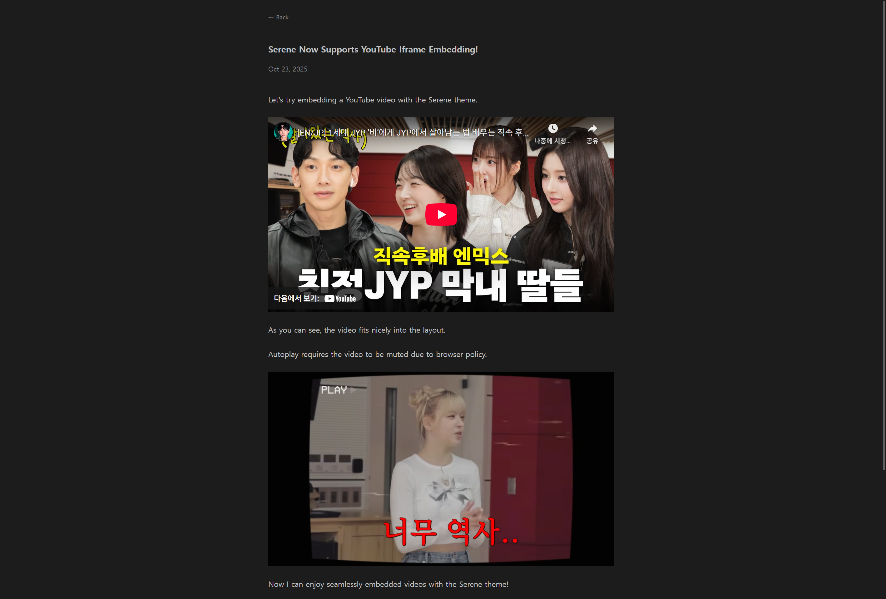

+++
title = "Contribution to serene, Zola template"
date = 2025-10-23
[extra]
toc = true
comment = true
+++

블로그 SSG를 Jekyll에서 Zola로 바꾸게 된 계기중 하나가 _[serene](https://github.com/isunjn/serene)_ 이라는 테마가 깔끔하게 보여서였다.

Jekyll에서 테마를 이용할 때에 테마 코드를 약간 커스텀해서 사용했는데, 테마 리포지토리가 딱히 관리되지는 않는 것 같아서 개인적으로만 수정해서 사용했다. Zola의 _serene_ 테마는 소규모의 유저풀이지만 오픈소스 활동이 이따금 이루어지는 것 같아서 사용하면서 개선하고 싶은 아주 사소한 부분을 Issue나 PR을 통해 기여해보았다.

우선은 바로 PR을 올리기보다 해당 프로젝트가 어떤식으로 굴러가는지 분위기 파악을 하고 Issue부터 작성해보았다.

## `← Back` Button Issue

[이슈 링크: Back link misbehaves after ToC #anchor clicks #87](https://github.com/isunjn/serene/issues/87)

블로그 포스트에서 `#anchor` 요소를 누른 후에 `← Back` 버튼을 눌렀을 경우에 발생하는 오동작에 관한 이슈를 생성했다. 블로그 포스트를 작성할 때, 마크다운 기준으로 `#`, `##`, `###` 등으로 작성하면 HTML로 `<h1>`, `<h2>`, `<h3>` 로 변환됨과 동시에 해시 라우팅 링크가 적용된다. 블로그 포스트 UI 우측의 ToC 에서 각 소제목을 누르면 해시 라우팅을 통해 바로 해당 단락으로 이동할 수 있게 되는 일반적인 기능이다.


그런데, 이 해시 라우팅된 버튼을 누르고 난 다음에 블로그 포스트 작성 목록으로 돌아가려고 `← Back` 버튼을 누르면, 블로그 포스트 목록 페이지로 넘어가는게 아니라 해시 라우팅된 버튼을 누르기 전 URL로 돌아간다.

즉, `https://blog.com/posts/postTitle/` 이라는 블로그 포스트 페이지에 `First Paragraph` 라는 소제목 해시 라우팅을 클릭하면 `https://blog.com/posts/postTitle/#first-paragraph` 로 URL이 변경되는데, 이 때 `← Back` 버튼을 누르면 `https://blog.com/posts/` 라는 블로그 포스트 작성 목록이 나오는 것이 아니라 `https://blog.com/posts/postTitle/` 로 URL이 전환된다.

게다가 해시 라우팅을 여러 번 누르면 여러 번 누른 만큼 `← Back` 버튼이 오작동한다.

오작동이 발생한 기존 코드는 아래와 같다.

```js,linenos,hl_lines=5-7
function enableBackLink() {
  const backLink = document.querySelector('#back-link');
  if (!backLink) return;
  backLink.addEventListener('click', (e) => {
    if (document.referrer && location.href.startsWith(document.referrer)) {
      e.preventDefault();
      history.back();
    }
  });
}
```

5번줄 조건과 6, 7번줄에 의해 `history.back()` 이 실행되어 오작동한 것이다. 원래 _serene_ 테마에서 설정된 macro로 `← Back` 버튼은 `<a>` 태그로서 적절한 `href` 링크 값이 부여된다. 이 `href` 로 지정된 링크 값이 `e.preventDefault();` 로 인해서 실행되지 않고 `history.back()`가 실행되어 오작동하였다.

5번줄 조건에 해당하지 않는 경우에는 그냥 `href` 값으로 링크된다. 만약 구글 검색과 같은 경로를 통해 블로그 포스트에 방문하게 되었다면, 이전 페이지가 구글 검색 화면일 수 있으므로 `history.back()` 을 동작시키지 않고 `href` 링크 값에 macro로 미리 정의된 값 (여기서는 블로그 포스트 작성 목록) 으로 보내도록 구현된 것이다.

아래와 같이 `post.html` 이라는 템플릿에 macro가 구현되어있다. macro는 템플릿 엔진에서 으레 사용되는데, Zola의 경우 Jinja2, Django templates 등과 유사한 [Tera Template Engine](https://keats.github.io/tera/) 을 통해 매크로를 처리한다.

```html
{{ macros::back_link(path = get_url(path=section.path)) }}
```

감사하게도 아래와 같이 테마 레포 owner가 빠르게 `!location.hash` 조건을 추가하여 해당 문제를 해결해주었다.

```js,linenos,hl_lines=5
function enableBackLink() {
  const backLink = document.querySelector('#back-link');
  if (!backLink) return;
  backLink.addEventListener('click', (e) => {
    if (document.referrer && location.href.startsWith(document.referrer) && !location.hash) {
      e.preventDefault();
      history.back();
    }
  });
}
```

개인적으로 개발하면서 유사한 문제를 겪어본 경험이 있는데, 라우팅을 다루다보면 흔히 겪는 전형적인 문제인 것 같다.

## `<li>` Issue

[이슈 링크: Suggestion: Adjusting \<li> margin size for more balanced spacing #89](https://github.com/isunjn/serene/issues/89)

블로그 포스트를 작성하면서 느낀 것중 하나가 `<li>` 태그의 마진 간격이 지나치게 커서 왠지 부해 보였다.


margin 값이 상하로 `1em` 으로 설정되어 있었다.

아래는 기존에 설정된 `1em` 으로 본 `<li>` 태그의 모습이다.


얼핏보면 괜찮은 것 같기도하고 부해보이기도 하고 애매했다.

개인적으로 테마를 포크해서 혼자 커스터마이징해서 써도 괜찮지만 테마를 꾸준히 업데이트하고 관리하는 것 같아서 그냥 이슈를 작성하는 쪽으로 마음을 먹었다. 특히 스타일 요소는 개인 취향의 영역이라 이슈를 쓸지 말지 상당히 고민을 했는데, 좀 더 객관성을 갖추기위해 Zola의 여러 템플릿들을 찾아보고 역시 `1em` 은 비교적 큰 것 같아서 이슈를 작성했다.

이 역시 감사하게도 테마 레포 owner가 `0.5em` 으로 간격을 줄여주었다.

## Youtube iframe Embeded PR (Not merged yet)

[PR 링크: feat: add YouTube embed shortcode #92](https://github.com/isunjn/serene/pull/92)

블로그 포스트를 작성하면서 유튜브 영상을 참조할 때가 있었는데, 참조한 유튜브 영상 링크만 남겨두기보다 포스트 자체에 유튜브 영상이 나타나도록하는 기능은 없는지 궁금했다.

찾아보니 Zola 자체의 기능은 아니고, 테마에서 지원하도록 shortcode를 작성해두면 `iframe` 태그로 유튜브 영상을 임베드할 수 있었다. [Zola shortcodes](https://www.getzola.org/documentation/content/shortcodes/)란, wordpress의 그것과 유사한 개념이라고 설명하고 있는데, 앞서 **`← Back` Button Issue**에서 언급한 macro에서 좀 더 확장된 개념이다. shortcodes는 아래와 같은 경우에 사용할 수 있다고 한다.

- 좀 더 복잡한 HTML을 작성할 때 사용: 인라인 HTML이나 스타일링이 필요할때는 마크다운만으로는 부족함
- 반복적인 데이터를 활용한 작업이 있을 때 사용: 외부 데이터(`fetch` 등을 통해 외부 서버로부터 불러들여야할 동적인 데이터)를 페이지에 보여주고 싶을때, Zola는 SSG지만 이를 활용하여 동적인 데이터를 활용 가능

즉, 여러 페이지에서 반복되는 코드 블록을 템플릿으로 만들어 처리하는 것은 macro와 유사한 기능이고, Zola가 SSG임에도 동적으로 외부 서버로부터 데이터를 가져와서 활용할 수 있도록 하는 것이 shortcodes의 핵심적인 기능이다. shortcodes 활용 예제를 보면 shortcodes가 무엇인지 바로 이해할 수 있는데, 아래와 같은 Zola 공식 문서의 shortcode 예제 코드가 심지어 내가 구현하고자한 유튜브 임베딩 예제이다.

```html
<div class="{{class}}" >
  <iframe
    src="https://www.youtube.com/embed/{{id}}?autoplay=1"
    webkitallowfullscreen
    mozallowfullscreen
    allowfullscreen
  >
  </iframe>
</div>
```

외부 서버(유튜브)로 부터 동적으로 동영상 정보를 가져오는 것이니까 shortcodes의 적절한 예다.

shortcode를 통한 유튜브 임베딩 기능은 Zola의 여러 테마를 둘러보니 지원하는 테마도 있고, 지원하지 않는 테마도 있는 것 같았다. 내가 이용하고 있는 _serene_ 테마에서는 지원하지 않고 있었다. 테마를 이용하는 주 유저풀의 국가가 Youtube 이용이 제한되는 국가이거나, 굳이 글이라는 컨텐츠에 영상 컨텐츠를 삽입하는 것이 선호되지 않아서 일수도 있겠거니 추측했다.

아무튼 나는 유튜브 임베딩 기능을 넣어두는 것이 좋다고 생각했고 관련된 코드를 작성하여 Pull Request를 진행하였다. Zola 공식 문서에서 설명하고 있는 유튜브 임베딩 예제 shortcode는 블로그 포스트 템플릿의 CSS를 전혀 고려하지 않은 예제 코드라서, 유튜브 영상 비율이 깨지는 예제였다.

또, 임베딩하면서 영상 자동 재생 옵션을 `autoplay` 값을 통해 설정할 수도 있는데, Zola 공식 문서의 예제 코드에서처럼 `autoplay=1` 값만 설정하면 브라우저 정책상 자동 재생되자마자 영상이 멈춰버린다. `mute=1` 옵션과 함께 자동재생해야 영상이 끊임없이 이어지는데, 이는 음소거 상태로만 자동재생할 수 있게한 브라우저 정책 때문이다.

결국 CSS 비율 문제나, `autoplay` 옵션이 잘못된 Zola 공식 문서의 예제를 조금 수정하여 PR을 제출하고 테마 레포 owner의 리뷰를 반영하여 머지를 기다리는 상태다.


