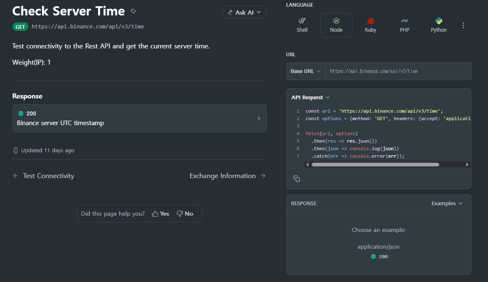
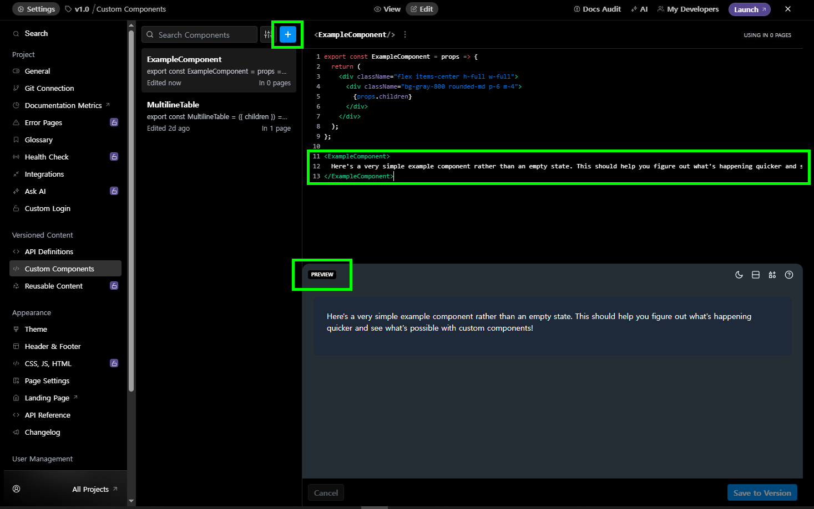
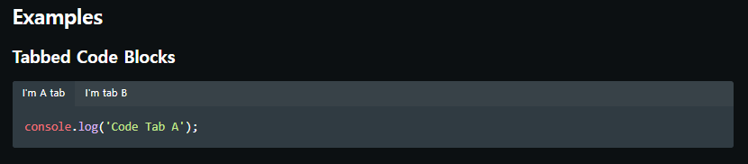
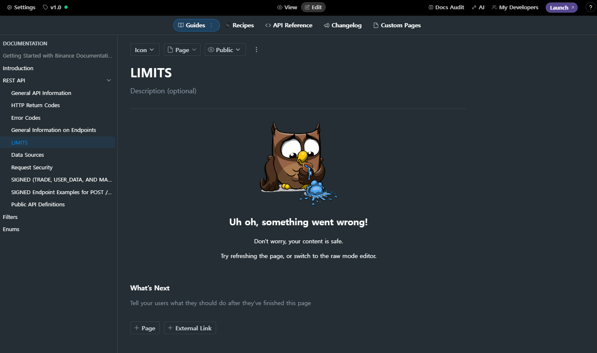
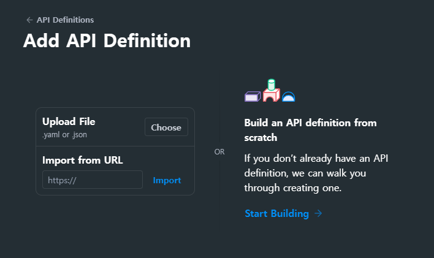
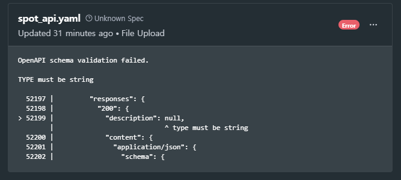
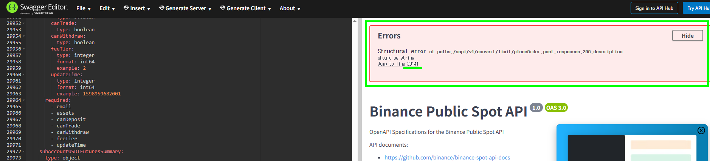
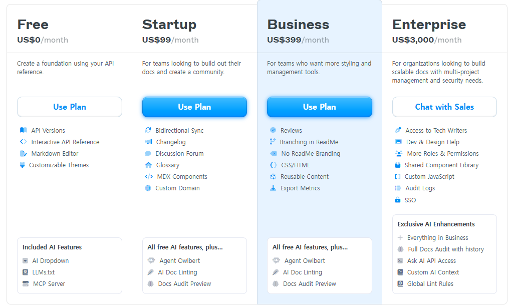
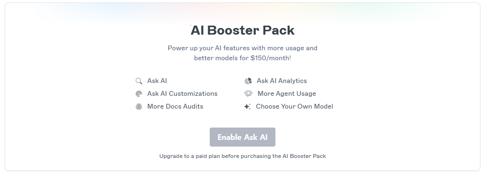
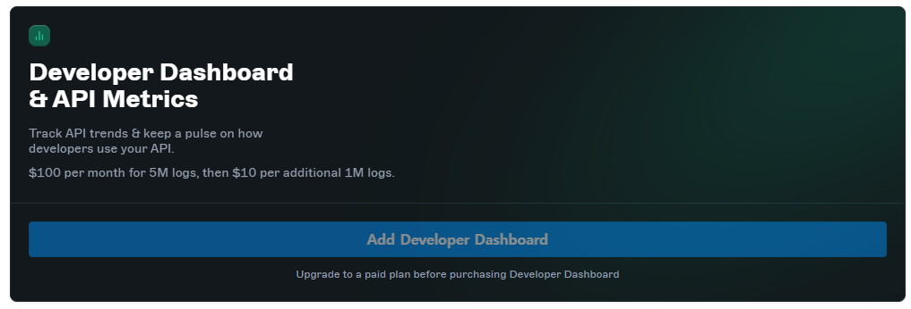

+++
title = "ReadMe.io Quick Look through a Binance API Docs Clone"
date = 2025-10-06
[extra]
toc = true
comment = true
+++

Binance API 문서에 사용된 SSG가 Slate에서 Docusaurus로 업데이트 된 것에 대해 [블로그 아티클](https://gloomydumber.github.io/posts/binancedocsupdatemisc/)로 다뤄보면서, 이전부터 문서 생성에 있어서 좋은 프로덕트라고 생각한 [ReadMe.io](https://readme.com/)에 대해 알아보고 싶었다.

해당 플랫폼을 사용한 서비스를 최초로 접한건 Upbit API 문서에서였다. 초기에는 별 생각이 없었는데, 어느 버전 이후에 아래와 같이 언어별로 Request Code Sample 섹션이 제공될 때, 무슨 설루션을 사용한건가 싶어서 찾아보고 해당 UI/UX에 감동하고는 ReadMe.io 라는 문서화 플랫폼을 기억해두고 있었다.



ReadMe라는 이름 자체가 프로그램이나 프로젝트의 사용법, 설치 안내, 저작권과 같은 여러 메타데이터 등의 정보를 포함하는 파일의 이름으로 쓰이다보니 SEO에 굉장히 불리할 것 같은데 왜 굳이 그렇게 이름지었나 싶은 생각이 들긴했다. 실제로 구글에 ReadMe에 대해서 검색해보면 해당 문서화 플랫폼을 다룬 내용이나 정보 보다는 파일 이름으로써의 readme, 그러니까 *readme.md 작성법* 과 같은 내용의 결과가 많았다. 이 때문에 LLM에 질문을 하거나 할때는 햇갈릴 수 있으니 굳이 ReadMe.io 라고 전체 도메인 주소로 작성하거나 부연설명을 한다. 비록 SEO 측면에서는 다소 불리할 수 있지만, ‘ReadMe’라는 이름은 문서화 플랫폼의 브랜드명으로서는 충분히 적절해 보인다. ReadMe는 프로덕트가 존재하면 항상 작성해야하니까— (비슷한 사례로 Cursor는 성공적인 네이밍인 것 같다)

어쨌든, ReadMe의 기능에 대해 적당히 문서를 훑어보고 Binance API를 ReadMe를 통해 다시 작성해보면 ReadMe의 장단점을 알 수 있을 것 같아서 소위 Clone-Documentation을 해보았다. 학습 목적으로 Clone-Coding을 많이하니까 비슷한 결로 Clone-Documentation을 해보면 배우는게 있을 것 같았다. 물론, 문서의 내용을 있는 그대로 갖다 쓰는건 단순한 마이그레이션에 불과할 것이다. 그래서 문서 내용 그 자체보다는 ReadMe의 기능에 대해서 가볍게 알아보는 것을 목표로 했다.

## ReadMe Refactored

이번에 사용하게 된 ReadMe 버전은 *ReadMe Refactored* 라는 이름으로 문서화 작업에 있어서 중요한 몇몇 기능이 추가되어 업데이트 된 버전을 사용하게 되었다. [ReadMe 블로그 아티클](https://blog.readme.com/readme-refactored-new-editing-experience-bi-directional-syncing-with-github-2/)에 따르면 대략적으로 아래와 같은 기능이 2024년 11월 경의 업데이트에서 추가되었다.

- **New Editing UI**: 온라인 에디터의 UI가 개선된 듯하다. (구버전을 안써봐서 잘 모름)
- **MDX Component**: MDX 지원으로 커스텀 컴포넌트나 Mermeid.js 다이어그램을 지원한다.
- **Bidirectional Sync with Github**: Github과 양방향 연동으로 Docs as Code 방식으로 문서를 관리할 수 있다.
- **My Developers**: 유저들의 API 요청 내역을 집계한 데이터로 개발자 경험 향상에 활용한다.

여기서 주목한 점은 아무래도 MDX Component 지원 부분과 Bidirectional Sync with Github 기능에 주목했다.

문서화는 아무래도 ReadMe와 같은 문서화 설루션을 통해 편리하게 진행하면서도, 커스텀 가능한 부분이 많이 필요할 것 같아서 Customizable MDX Component의 지원은 중요한 지점인 것 같다. 커스텀 가능한 자유도가 많이 떨어지면, 결국 SSG가 아니라 Next.js와 같은 웹 프레임워크을 이용해서 처음부터 끝까지 다 개발해야하는 문제가 생긴다. 따라서 문서화 설루션은 문서화를 위한 적절한 정도의 기본적인 구조와 기능을 제공하면서도 적절한 정도의 자유도를 제공해야한다. 그 적절한 정도를 어느 정도로 할 것인지가 문서화 설루션의 핵심 문제인 것 같다.

Bidirectional Sync with Github 기능은 오히려 왜 이리 늦게 추가되었는지 의문이었다. 조사한 바에 따르면 ReadMe가 2014년 경에 설립되고, 2015년 경에 Y Combinator 투자를 받았다고하니 Docs as Code 철학은 2024년이 아니라 한참 전에 적극적으로 구현되어있으리라 생각했다. 지금은 이 기능을 통해 문서와 Github을 연동하는 설정을 해두면, 온라인 에디터에서 문서를 새로 작성하거나 수정했을 경우에도 저장을 눌렀을 때 Github Repository로 연동되는 식으로 변경사항이 바로 반영되어 편리하다. 물론 양방향 연동이기 때문에, VS Code와 같은 코드 에디터를 통해 작성한 내용도 Github Repository에 푸시했을 경우 온라인 에디터에도 잘 반영된다. 그 전에는 [`rdme`](https://github.com/readmeio/rdme) 라는 툴을 통해 CLI 환경과 Github Action을 이용하는 등의 제한된 방식으로나마 연동이 가능했던 것 같다.

이 두 기능을 포함해 몇몇 기능을 사용하면서 있었던 경험을 아래와 같이 간략하게 써보았다.

## MDX Component

우선 MDX Component의 자세한 작성법은 공식 문서 [ReadMe | Create Your First Component](https://docs.readme.com/main/docs/building-custom-mdx-components#create-your-first-component)를 참조하여 작성하면 된다.

MDX Component를 작성하는 방법도 온라인 에디터를 이용하는 방법과 코드 에디터를 이용하는 방법이 있다. 공식 문서에서는 온라인 에디터에서 작성하는 방법만 설명되어 있다.

온라인으로 작성할 때의 UI는 아래의 이미지와 같다. 아래 이미지에서는 `<ExampleComponent />` 라는 이름의 컴포넌트 예제를 보여주고 있다.



기본적으로 `export` 키워드를 통해 작성한 컴포넌트를 외부에서 사용할 수 있도록한다. 특이사항으로는 컴포넌트를 정의했음에도 밑에서 컴포넌트를 한번 실제로 작성해놓는데, Preview에서 미리 렌더링하여 보여주는 기능을 위해 작성한 듯하다.

버전 관리 시스템을 이용하여 직접 코드 에디터를 통해 작성할 때에는 레포지토리의 `custom_blocks` 하위 폴더에 `파일명.mdx` 의 형태로 작성하면 된다. 온라인 에디터에서 보았던 `<ExampleComponent />` 예제가 아래와 같은 코드 형태로 불러와 진다.

```mdx
---
name: ExampleComponent
---
export const ExampleComponent = props => {
  return (
    <div className="flex items-center h-full w-full">
      <div className="bg-gray-800 rounded-md p-6 m-4">
        {props.children}
      </div>
    </div>
  );
};

<ExampleComponent>
  Here's a very simple example component rather than an empty state. This should help you figure out what's happening quicker and see what's possible with custom components!
</ExampleComponent>
```

최상단에 `name` 이 따로 YAML frontmatter로 작성되어있는 것 외에는 온라인 에디터와 별다른 점은 없다. 코드 에디터로 작성한다면 온라인 에디터처럼 프리뷰를 통해 렌더링 결과를 바로 확인 수 없지만 말그대로 코드를 Code를 작성하는 데 특화된 Code Editor에서 작성하는 이점은 있다.

MDX Component 기능 중에 가장 아쉬운 점은 외부 라이브러리의 임포트가 되지 않는다는 점이다. 특히, ReadMe는 Markdown 파서로 [ReadMe Markdown](https://github.com/readmeio/markdown) 이라는 파서를 사용해서 Markdown을 HTML로 변환한다. MDX Component를 작성하면 이 ReadMe Markdown이라는 파서가 해당 MDX Component를 처리하는데, 문서 작성자 내지는 개발자가 그 처리 과정에 개입할 방법이 없기 때문에 한정된 수준의 커스텀 컴포넌트만 개발할 수 있는 것이다. 이 ReadMe Markdown 파서는 [remark](https://github.com/remarkjs/remark)에서 수정된 형태로 구성되었는데, Docusarus의 경우에도 remark를 사용하다보니 컴포넌트 커스터마이징에 한계가 있는 것 같다. 그런데 Docusaurus의 경우에는 문서에 따르면 remark 생태계의 다양한 plugin은 사용할 수 있도록 지원한다. Readme Markdown 파서는 그마저도 불가능한듯하다. Docusaurus에서의 커스터마이징은 직접 깊이있게 해보진 못했고, [LY Corp. Tech Blog | 기술 문서 사이트로 Docusaurus 활용하기](https://techblog.lycorp.co.jp/ko/docusaurus-as-a-technical-document-website) 글에서 읽고 ReadMe의 경우를 비교하고 살펴보게 되었다.

안타까워서 MDX Component의 커스터마이징 기능에 대해 티켓을 써봤는데, 에디터 자체가 브라우저에서 샌드박스로 구동되고 로컬 개발자의 프로젝트 빌드 파이프라인의 번들러(vite, webpack, parcel 등)가 없으니 외부 라이브러리 임포트는 안된다는 원론적이고 당연한(?) 답변이 돌아왔다.

ReadMe는 위 예제 컴포넌트 코드에서 확인할 수 있듯이 Tailwind CSS를 지원하는데, 사실 지원한다고 표현하지만 강제한다고 표현할 수도 있을 것 같다. ReadMe Markdown 파서에서 [Tailwind 관련 Processor](https://github.com/readmeio/markdown/blob/4e13b19ee43f2ead9413810fa06c02e4c45b11fb/processor/transform/tailwind.tsx)가 항상 동작하고 있기 때문이다.

아무튼 ReadMe Markdown이라는 파서가 강제된다는 점은 단점인 것 같다.

사실 Binance API를 옮겨 적으면서는 Custom MDX Component를 작성할 일은 없었다. 대신에 블록체인 관련하여 접한게 많다보니 샌드박스 환경에서 WebAssembly 등을 통해 Solidity 컴파일하고 실행하는 과정을 문서 상에서 보여주고 싶은 욕심이 생겨서 관련된 컴포넌트를 작성할 수 있을까하고 조사해봤는데 역시 기술적으로 어려운 것 같다. 차선책으로는 `iframe` 을 통해 gist로 미리 작성된 Solidity 코드를 Remix 에디터로 띄워주는 것이었는데, 띄워지긴 하는데 UX가 영 나쁘다.

## Docs as Code 경험기

[Docs as Code](https://www.writethedocs.org/guide/docs-as-code/#docs-as-code)는 기술 문서를 소스 코드처럼 관리하는 철학으로, ReadMe에서는 Bidirectional Sync with Github 기능을 통해서 실현할 수 있게 되었다. Bidirectional Sync with Github 기능에 따른 Repository의 구조는 [ReadMe Docs | Documentation Structure](https://docs.readme.com/main/docs/documentation-structure)에 잘 명세되어있다.

매일 배운 개념을 Github의 TIL(Today I Learned) Private Repository에 Markdown 형식으로 저장하는 버릇이 있는데, 그 버릇 덕분인지 VS Code와 같은 코드 편집기에서 문서를 작성하는 것이 굉장히 편하게 느껴졌다. 다만, 몇가지 주의할 점이 있는데, 공식 문서 [ReadMe Docs | Troubleshoot MDX Errors](https://docs.readme.com/main/docs/rendering-errors-invalid-mdx#closing-tags) 에서 다루는 것과 같이 HTML 태그를 나타내는 '<'와 같은 몇몇 문자들을 '\\<' '\&lt;' 와 같은 식으로 잘 표기해야 할 때가 있다.

다음으로는 사실 ReadMe의 문제라기보다는 Prettier의 문제인데, ReadMe에는 다음과 같은 [Tabbed Code Block](https://docs.readme.com/rdmd/docs/code-blocks#tabbed-code-blocks) 기능이 있다.

```md
    ```javascript I'm A tab
    console.log('Code Tab A');
    ```
    ```javascript I'm tab B
    console.log('Code Tab B');
    ```
```

두 코드블록에서 이처럼 끝나는 \``` 와 시작하는 \```를 붙여서 작성하면 아래와 같은 이미지처럼 탭이 있는 코드블록을 만들 수 있다.



그런데, 해당 기능을 사용하여 문서를 작성하고나서 저장을하면 Prettier의 Format on Save 기능 때문에 아래와 같이 코드가 바뀌어 저장된다.

```md
    ```javascript I'm A tab
    console.log('Code Tab A');
    ```

    ```javascript I'm tab B
    console.log('Code Tab B');
    ```
```

끝나는 \``` 와 시작하는 \```를 한 줄 띄워줘버린다. Prettier의 설정을 바꾸면 될일이지만, 그마저도 귀찮아서 코드 블록 탭이 있는 문서에 대해서만 CTRL(CMD) + SHIFT + P 후에 Save without Formatting을 타입하는 수고를 했다. 아무래도 문서 작성할 일이 늘면 이런저런 Syntax를 고려한 Prettier 설정을 해주긴 해야할 것 같다.

또 달리 고려할 점으로는, ReadMe 계정과 Github 계정이 연동되는 것이 아니라, ReadMe 계정과 Github Repository가 연동되는 개념이라 Git에서 변경사항 발생시 이메일 단위로 기록되어서 ReadMe 계정 이메일과 Github 계정 이메일을 일치시켜서 사용하는 것이 좋을 것 같다.

브랜치 관리 기능은 Docs as Code의 핵심 부분에 해당하지만 브랜치 기능은 유료 버전에서 지원하기 때문에 직접 경험해보지는 못했다. 다만 공식 문서의 관련 명세를 보니 지원이 잘 되고 있는 것 같다. 실제 배포전에 `dev` 브랜치에 올려놓고 리뷰를 받는 것 처럼 문서도 여러 작업자에 의해서 검토받을 수 있게 되어있다.

## Online Editor 사용기

코드 에디터 환경에서 문서를 작성하는 데에는 거의 불편함을 느끼지 않았다. 코드 에디터 환경과 온라인 에디터 환경 둘 중에 하나만 사용해야한다면 코드 에디터 환경을 택할 것이다. 그럼에도 새로운 기능 같은 것들은 온라인 에디터를 통해서 먼저 만져보고 수정사항을 반영하면 해당 내역이 Github Repository로 연동되어서 새로운 기능이 코드 에디터에서 코드 상으로는 어떻게 반영되는지 볼 수 있어서 한 번씩 온라인 에디터를 써야할 것 같다. 또, 온라인 에디터 환경도 UI가 우수한 편이라 주력으로도 쓸만해보인다.

그럼에도 치명적인 문제가 있는데, 역시 네트워크 환경이 좋지 않으면 커서가 순간이동하거나 그에 따라 작성된 글도 순간이동하는 경우가 있다. 노션에서도 이런 현상이 가끔 있었는데 웹에서 사용하는 에디터의 특성상 어쩔 수 없는 문제인 듯하다. 더 큰 문제는 알 수 없는 문제로 한 번씩 아래와 같은 오류가 생긴다는 것이다.



작성 중인 내용이 모두 없어지고, 부엉이 마스코트와 함께 'Don't worry, your content is safe. Try refreshing the page, or switch to the raw mode editor.' 라고 뜨는데, 'raw mode'로 진입해도 안뜨길래 새로고침 했더니 수정하고 저장하지 않았던 글들이 모두 증발했다. 네트워크 환경이 영향을 끼쳤을 수도 있고, 온라인 에디터 특성상 여러 기능을 지원하다보니 오류가 생긴 것 같기도하다.

{{ figure(src="./img/ieErrorSend.png", alt="ieErrorSend", caption="Internet Explorer 오류 보고 보냄...") }}

써보면서 느낀 또 다른 사소한 문제는 Markdown으로 Table을 썼을 때 예쁘게 쓰기가 힘든게 문제다. 코드 에디터에서 Prettier를 이용하면 막 작성한 Markdown Table도 행간-자간이 예쁘게 포맷된다.

다만, 후술할 AI 기능 등 ReadMe의 특별한 기능들을 이용하려면 온라인 에디터로 접근해야만하는 부분이 있는 것 같다.

## OAS 파일 불러오기

ReadMe는 `.yaml` 이나 `.json` 형식의 OAS(OpenAPI Specifiaction) 명세 파일을 지원한다. 마침 Binance에서도 Swagger로 띄워볼 수 있게 [binance-api-swagger](https://github.com/binance/binance-api-swagger) 라는 Github Repository를 제공하고 있다. 해당 Repository에서 구현된 명세가 완전 최신인 것 같지는 않지만, 파일 하나로 API 문서를 마이그레이션 할 수 있는 좋은 기능이 있으니 한 번 써보았다.



Binance API를 명세한 OAS 파일은 해당 Repository에서 `spot_api.yaml` 이름으로 올라와있다. 이 파일을 그대로 ReadMe 온라인 에디터에 업로드하면 오류가 발생했다. *OpenAPI schema validation failed.* 라며 스케마 검증이 잘못되었다는 오류다. 그런데 이어지는 오류 내용이 영 난해해서 어디가 잘못되었는지 알아내기가 힘들었다. 비교적 최근에 올려져 반영되지 않은 Pull Request에 있는 코드로 다시 새로 업로드하니 아래 이미지와 같이 52199줄에서 값이 `null` 이면 안된다는 오류가 발생했다.



그런데, `spot_api.yaml` 파일은 30230줄이 EOF다. 혹시나 하는 마음에 [Swagger Editor](https://editor.swagger.io/)에 접속하여 해당 파일의 내용을 붙여넣기 해보았다. 그랬더니 아래 이미지와 같이 20141줄의 `description`이 `string`이여야 한다고 정확한 오류 로깅을 해주었다.



확실히 [spot_api.yaml의 20141줄](https://github.com/binance/binance-api-swagger/blob/64b327c0addadd191ca0dca8e6b4cebd8a97c05c/spot_api.yaml#L20141)을 보니 `description` 필드에 아무것도 적혀있지 않았다. 그래서 `string`이 아닌 `null` 로 인식되어서 오류가 발생한 것 같아 아무값이나 입력하여 ReadMe에 업로드하니 정상적으로 동작하였다.

{{ figure(src="./img/readmeOASUploaded.png", alt="readmeOASUploaed", caption="ReadMe에 정상적으로 OAS 파일이 업로드되어 API가 명세된 모습") }}

글의 제일 앞에서 언급한 Request Code Sample 기능은 명세에 따라 자동으로 언어별로 예제 코드가 생성되는데, 좀 더 정확한 가이드를 위해서는 문서 작성자가 직접 예제 코드를 쓰는게 좋을 것 같다.

## AI 관련 기능 이모저모

ReadMe 만큼 AI 관련한 기능을 열심히 제공해주는 문서화 관련 프로덕트나 SSG는 없는 것 같다. 지금도 실시간으로 AI 관련 기능이 업데이트 되고있다. AI 관련 기능은 적극적으로 사용해보지는 않고, [ReadMe Docs | AI](https://docs.readme.com/main/docs/aiagent)에 명세된 각각의 항목들을 읽어보았다.

- **Agent**: Gemini, GPT, Claude와 같은 LLM 모델을 통해 문서의 윤문/퇴고/교정/교열 등의 작업을 수행하는 기능
- **Linter & Docs Audit**: AI Agent의 Personality를 설정하는 것처럼 Style Guide, Errors, Warnings 항목을 미리 자연어로 작성하여 규칙으로 설정해두면 해당 규칙에 따라서 문서를 Lint해주는 기능
- [**MCP (Model Context Protocol)**](https://modelcontextprotocol.io/docs/getting-started/intro): 말그대로 AI가 문서 내용을 활용해 동작할 수 있도록 요청에 따른 적절한 자원을 제공해주는 전용 MCP 서버를 제공하는 기능. 가령, LLM 모델이 유저의 명령에 따라 MCP Server를 이용해 문서에 명세된 API Endpoint에 자체적으로 Request를 하고 Response를 받아와 처리할 수 있다.
- **LLMs.txt**: robots.txt와 비슷한 개념인데, AI 모델이 해당 사이트를 어떻게 의미론적(semantic)으로 이해해야하고 최적화해야하는지 정의해놓은 텍스트이다. 미리 정의해놓아야 LLM이 결과를 생성하는 데에 도움을 준다.
- **Ask AI & AI Dropdown**: 문서의 내용에 대해 간편하게 LLM에 질문할 수 있도록 하는 기능

10월 8일자로 올라온 [유튜브 영상](https://www.youtube.com/watch?v=LJFhqaUAYoY)은 5분 이내의 영상으로 ReadMe를 이용한 문서화에 AI를 활용하는 내용을 쇼케이스로서 잘 보여주고 있다.

## 유료 플랜 & 기능

아래와 같이 Free / Statup / Business / Enterprise 4개의 플랜으로 나뉘어 기능을 제공한다. 문서를 배포하지 않고 Free Trial 기능으로 사용해볼 수 있던 Bidirectional Sync와 MDX Components가 유료기능이었다.



LLM의 유료 플랜을 사용할 수 있도록 해주는 AI Booster Pack 이라는 상품도 따로 존재한다.



API 요청 상황을 집계하고 관리할 수 있는 대시보드를 사용하는 상품도 따로 존재한다.



## Clone-Documentation 결과

너무 ReadMe의 기능에 대해서만 쓴 것 같아 Clone-Documnetaion을 진행함에 있어서 Binance API 문서의 구조나 내용에 대해서 하찮은 내용이지만 조금 써두어야겠다.

Docusaurus를 사용한 신버전의 Binance API 문서만 읽어가며 진행한게 아니라, Slate를 사용한 구버전의 Binance 문서와 비교해서 읽어가며 ReadMe로 작성했다. 영문이다 보니 내가 직접 내용적으로 크게 손댈 수 있는 부분은 없었지만, 신버전으로 옮기면서 글의 배치나 내용이 약간씩 달라져서 향상됐다는게 느껴졌다. 몇 개 부분은 구 버전을 따라서 쓰긴 했지만, 대부분 자연스레 신버전을 따라서 작성하게 되었다. 구버전의 예를 따른 것으로는 구버전 Slate에서 Callout을 사용한 부분은 신버전에서는 Docusaurus의 admonitions을 사용하면 되는데 의도가 있는지는 모르겠지만 평문 그대로 작성된 부분이 있었다. 그걸 보고 여전히 중요한 구문이라고 생각해서 나는 ReadMe의 Callout Component로 표기했다.

{{ figure(src="./img/binanceDocsOld.png", alt="binanceDocsOld", caption="ReadMe의 Callout Component를 이용") }}

{{ figure(src="./img/binanceDocsNew.png", alt="binnanceDocsNew", caption="신버전에서는 admonitions 처리 없이 Bold만 적용") }}

이 글에서 다룬 것 말고도 ReadMe의 기능은 상당히 다양하다. 다양한 기능 업데이트가 상당히 꾸준하고 빠르게 이루어지고 있다. ReadMe의 문서를 보면 각 페이지마다 최근 수정일자가 적혀있는데 대 부분 몇 주전이고 늦어야 몇 달전이다. 기능 업데이트도 잘 되고 있지만 문서도 그에 따라 최신화가 잘 이루어진다는 뜻이겠지.