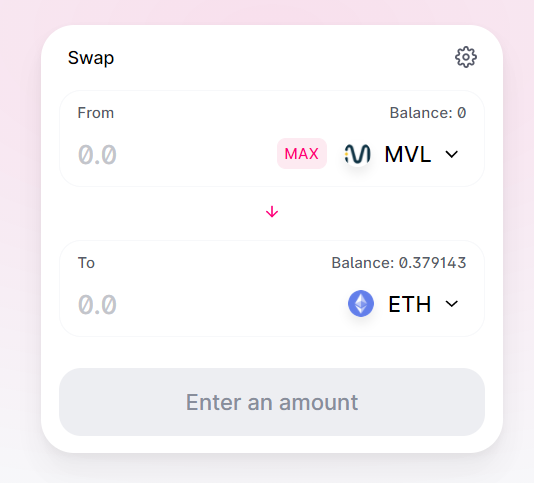
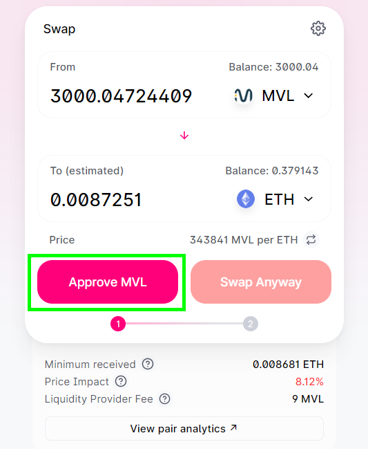
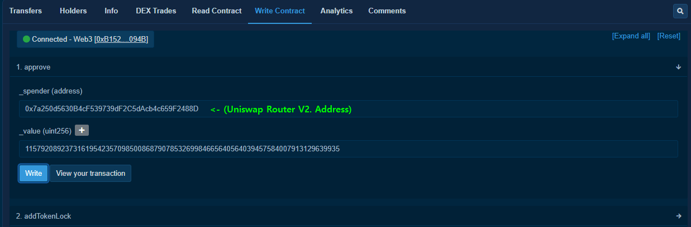
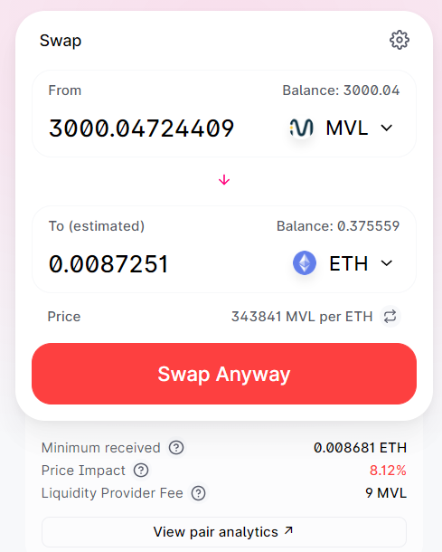

+++
title = "Uniswap: How to Manually Approve ERC20 Tokens"
date = 2021-01-23
[extra]
toc = true
+++

# Manually Approving ERC20 Tokens on Uniswap

## "Swap" Unavailable with Zero Token Balance

If you try to approve an ERC-20 token for trading on Uniswap but have a zero balance, the Uniswap UI won’t show the "Approve" button—meaning you can’t grant spending permission.

This can be frustrating if you're trying to pre-approve a token or interact with it before receiving any.

## The Redundant Approach

One common workaround is to deposit—or buy—a small amount of the ERC20 token just to make the "Approve" button appear, like in the image above.

But let’s be honest, that’s a pretty inconvenient and roundabout way to get things done.

## How to Call `approve()` Without Using Uniswap

A better way is to manually call the `approve()` function using Etherscan.

### Step-by-step:

1. Visit the token’s Etherscan contract page (make sure you’re using the **token address**, not the pair or any other contract):

   > https://etherscan.io/token/{tokenAddress}#writeContract

2. Go to the **Write Contract** tab and connect your Web3 wallet (e.g., MetaMask).

3. In the `approve` function:
   - For the **spender**, enter the Uniswap Router V2 address:
     > `0x7a250d5630B4cF539739dF2C5dAcb4c659F2488D`
   - For the **amount**, you can enter an infinite approval value:
     > `115792089237316195423570985008687907853269984665640564039457584007913129639935`

## Final Result

You’ve now successfully approved your token using Etherscan’s Web3 interface.

---

### References

- [Ethereum StackExchange post](https://ethereum.stackexchange.com/questions/88064/how-to-manually-approve-a-token-for-swap-on-uniswap-direct-contract-interaction)
