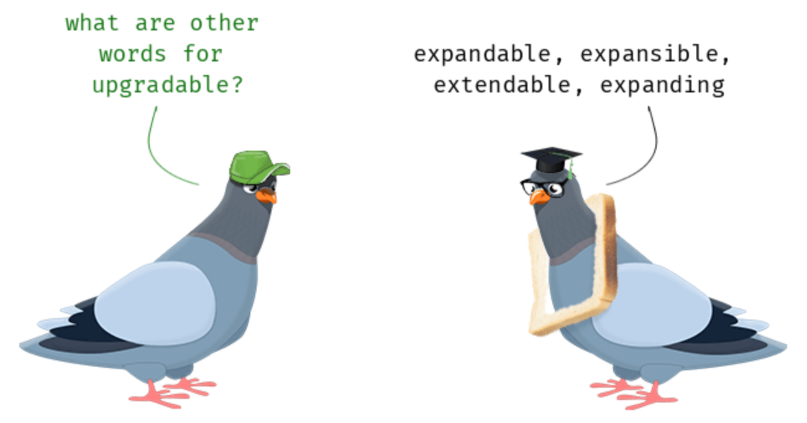
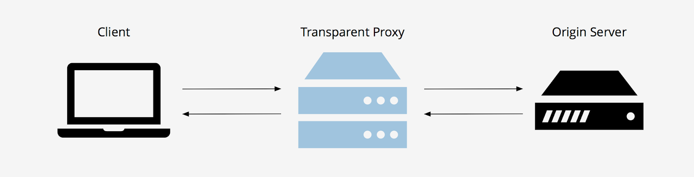
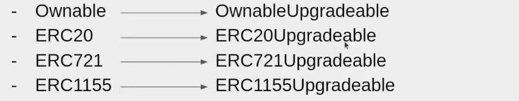
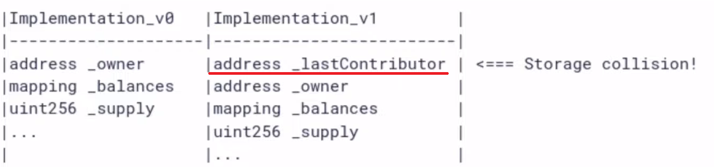

+++
title = "Upgradable Smart Contracts"
date = 2022-06-26
[extra]
toc = true
comment = true
+++

# Upgradable Smart Contracts

해당 포스트는 *moralis*의 [_What are Upgradable Smart Contracts? Full Guide_](https://moralis.io/what-are-upgradable-smart-contracts-full-guide/)을 참고하여 Upgradable Contract 개념에 대해 작성한 것 입니다.

## What are Upgradable Smart Contracts? Full Guide

|                 |
| :------------------------------: |
| <b>Upgradable Smart Contract</b> |

 우선, _Upgradable Smart Contract_ 에 대해서 이해하려면, 블록체인 개발의 기본 및 [_Delegate Call_](https://docs.soliditylang.org/en/v0.8.30/introduction-to-smart-contracts.html#delegatecall-and-libraries) 이라는 개념부터 완전히 이해해야한다. 

여느 개발자와 마찬가지로, Smart Contract 개발자들도 코드를 리팩터링하여 개선하거나, 새로운 기능을 추가하는 식으로 유지보수한다.
그러기 위해서는 이미 블록체인 상에 배포된 Smart Contract의 소스 코드 또한 수정해야할 것이다.
그러나, 블록체인은 그 특성상 한 번 블록체인 상에 이미 배포된 **데이터**는 변경이 불가하다.
이러한 블록체인의 특성을 _immutability(불변성)_ 이라 한다.
이러한 불변성을 통해, 유저들은 블록체인 상에서 이루어지는 다양한 거래가 악의적으로 조작되지 않을 것을 기대할 수 있다.
그런데, Smart Contract 또한 블록체인 상에서 이루어진 여느 일반적인 거래와 마찬가지로 **데이터**로서 배포되어 동작한다.
즉, 언뜻보기에는 이미 블록체인 상에 배포된 Smart Contract에 구현된 함수나 기능 또한 블록체인의 _불변성_ 에 의해 새로이 업데이트하거나 효율적으로 개선하는 것이 불가해 보인다.

이러한 문제를 해결하기 위해, _Upgradable Smart Contract_ 라는 개념이 존재한다.
또, _Upgradable Smart Contract_ 를 구현하기 위한 방식으로는 대표적으로 _transparent proxy_ 와 _upgradable proxy_ 가 존재한다.
본 아티클에서는 _Upgradable Smart Contract_ 개념과 이를 구현하기 위한 대표적인 방식인 _transparent proxy_ 와 _UUPS(Universal Upgradable Proxy Standard) proxy_ 를 설명한다.

## What are Upgradable Smart Contracts?

Smart Contract는 사전에 정의된 규칙에 따라서 작업이 실행되도록 함으로써, 순서를 지키며 동작한다. Smart Contract가 존재하지 않는다면 , _token_ 이나 _NFT_ 등, 다양한 _DApp_ 또한 존재할 수 없다. 그렇다면 _Upgradable Smart Contract_ 란 대체 무엇일까? 일단 주지해야하는 사실이 있다. _"Upgradable(업그레이드 가능한)"_ 이라는 개념이라는게, 변할수 있다(mutable)는 개념을 뜻하는게 아니다. _EVM_ 의 기본 규칙중 하나는, 일단 Smart Contract가 블록체인 상에 배포되는 순간, 변할 수 없다. 즉, immutable(불변적)이다. 이러한 _Ethereum Virtual Machine_ 의 대원칙을 어길 수 없기 때문에, _Upgradable Smart Contract_ 는 특수한 프록시 패턴을 사용한다. 프록시 패턴은 대표적인 소프트웨어 디자인 패턴으로서, 해당 패턴에 대한 자세한 설명은 [Refactoring Guru 사이트의 설명](https://refactoring.guru/ko/design-patterns/proxy)으로 갈음한다. 결론부터 말하자면, _Upgradable Smart Contract_ 를 구현하는 데에 있어서, 프록시 패턴은 아래의 두 컨트랙트로 분리하여 별도로 배포하는 식으로 적용되었다.

1. _proxy contract (storage contract 라고도 불린다)_
2. _logic contract (implementation contract 라고도 불린다)_


## How do Upgradable Smart Contracts Work?

위의 도식을 보면, 유저가 _logic contract_ 를 최종적으로 호출하기 위해서는 _proxy contract_ 를 거쳐서 상호작용하고 있음을 알 수 있다. 이것이 가능한 것은, _proxy contract_ 가 _logic contract_ 의 주소를 저장할 수 있기 때문이다. Smart Contract 에서는 변수를 선언하여 다룰 수 있고, 변수에 특정 contract의 주소값도 저장할 수 있음은 쉬운 개념이다. (가령, Solidity 에서는 `address` 를 변수 타입으로 선언할 수 있다) 만약, 우리가 새로운 _logic contract_ 를 구현해서 deploy했다면, _proxy contract_ 에 저장된 _logic contract_ 의 주소를 업데이트 된 새로운 컨트랙트의 주소값으로 바꿔주기만하면 된다는 것이 _Upgradalbe Smart Contract_ 의 핵심이다.

_Upgradable Smart Contract_ 를 구현하기 위한 프록시 패턴에는 여러 방법이 있다. 다만, 프록시 패턴이 여러 유형으로 존재하지만, 대부분의 프록시 패턴은 앞서 언급한 _transparent proxy_ 와 _UUPS(Universal Upgradable Proxy Standard)_ 의 형태로 구현된다. 다행히도, 이 두 타입의 예제 코드 모두 _OpenZeppelin_ 에서 제공하고있다.



## Transparent vs UUPS Proxy

앞서 언급한 바와 같이, *transparent*와 _UUPS_ 두 가지의 *proxy pattern*들은 가장 보편적인 방법이다. 두 방법 모두 같은 원리를 사용하지만, 약간의 다른 구조를 취하고 있다. 이에 둘을 비교하고, 두 프록시 패턴의 주요한 특징을 알아보도록하자.

**Transparent Proxy Pattern Type:**

- 업그레이드에 관련된 기능이 _proxy Contract_ 에서 관리됨
- 상대적으로 고비용
- 상대적으로 유지보수가 쉬움

**UUPS Proxy Pattern Type:**

- 업그레이드에 관련된 기능이 _logic contract_ 에서 관리됨
- 상대적으로 저비용
- 상대적으로 유지보수가 어려움



## How to Make a Smart Contract Upgradable?

_Upgradable Smart Contract_ 를 구현하기 위해서는 일반적으로 _Openzepplin_ 에서 구현해 둔 코드를 상속받아 활용할 수 있기 때문에, 굳이 프록시 패턴 자체를 우리 스스로 구현할 필요는 없다.

본 아티클에서는 _Openzeppelin_ 에서 구현한 코드에 대한 구체적인 설명은 해당 아티클에서 다루지 않고, 어떻게 상속받아야 하는지만 다루겠다.

1. 먼저, 우리는 _initializable_ 컨트랙트를 상속해야한다.

```solidity
contract ExampleContractName is initializable {}
```

_transparent proxy pattern_ 를 구현할 때는 위와 같이 _initializable_ 만 상속하여 사용하고, _UUPS proxy pattern_ 을 구현한다면 아래와 같이 _UUPSUpgradable_ 상속을 추가해야한다.

```solidity
contract ExampleContractName is initializable, UUPSUpgradable {}
```

2. 다음으로, 일반적으로 `constructor` 기능을 하는 `constructor () {}` 구문과 별개로 Smart Contract 를 활성화시키는 _initializer_ 함수를 추가할 필요가 있다. 즉, `function initialize() public initializer {}` 를 추가해야한다. 함수 이름이 굳이 _initialize_ 일 필요는 없으나, 끝의 `initializer` _modifier_ 부분은 필수적이다.

3. 다음으로, 기존 _OpenZeppelin_ 컨트랙트 라이브러리를 아래 그림과 같이 _upgradable_ 버전으로 바꿔줘야한다.



4. _initialize_ 함수에서, 함수인 _\_init_ 함수들을 다음과 같이 호출해야한다.

```solidity
function initialize() initializer public {
    __ERC1155_init(“”);
    __Ownable_init();
    __UUPSUpgradeable_init();
}
```

5. 마지막으로, `msg.sender`를 `_msgSender()`로 대체한다. proxy address가 아닌, 유저의 wallet address와 상호작용해야하기 때문이다.

## The main Limitation of Upgradable Smart Contracts

_Upgradable Smart Contract_ 을 활용할 때 가장 주의해야할 점은 _storage collision_ 문제이다.

_storage collision_ 을 고려하지 않는 식으로 미숙하게 _Upgradable Smart Contract_ 를 구현하면 치명적인 보안 사고로 이어질 수 있다.



위의 이미지는 새로운 컨트랙트 버전에서 새로운 변수명이 위에 선언되어있고, _storage collision_ 을 일으키고 있는 것을 나타낸다.

새로운 변수명은 꼭 아래 부분에 정의해야 _storage collison_ 이 일어나지 않는다.

## TL;DR

1. Immutable한 블록체인 환경에서도 _Upgradable Smart Contract_ 를 배포할 수 있다.
2. 이를 위해서 proxy pattern 을 활용하는데, _proxy contract_ 와 _logic contract_ 를 별도로 배포하는 방식이다.
3. 본문에서는 다루고 있지 않지만, _Upgradable Smart Contract_ 구현의 핵심은 _delegate call_ 을 이용하는 것이다.
4. _storage collision_ 이 일어나지 않도록 주의해야한다.

 해당 아티클은 Openzeppelin 코드에 대한 설명 추가, storage collision에 대한 자세한 설명 등 좀 더 자세한 사항을 업데이트 할 예정입니다. 

## References

- [Delegate Call - Solidity Docs](https://docs.soliditylang.org/en/v0.8.30/introduction-to-smart-contracts.html#delegatecall-and-libraries)
- [Proxy Pattern - Refactoring Guru](https://refactoring.guru/ko/design-patterns/proxy)
- [youtube video about upgradable Smart Contract on moralis.io](https://www.youtube.com/watch?v=af1i0z0jhkg)
- [constructor 대신 initializer 함수를 사용하는 이유](https://stackoverflow.com/questions/72475214/solidity-why-use-initialize-function-instead-of-constructor)
- [medium post about delegate call](https://medium.com/coinmonks/delegatecall-calling-another-contract-function-in-solidity-b579f804178c)
